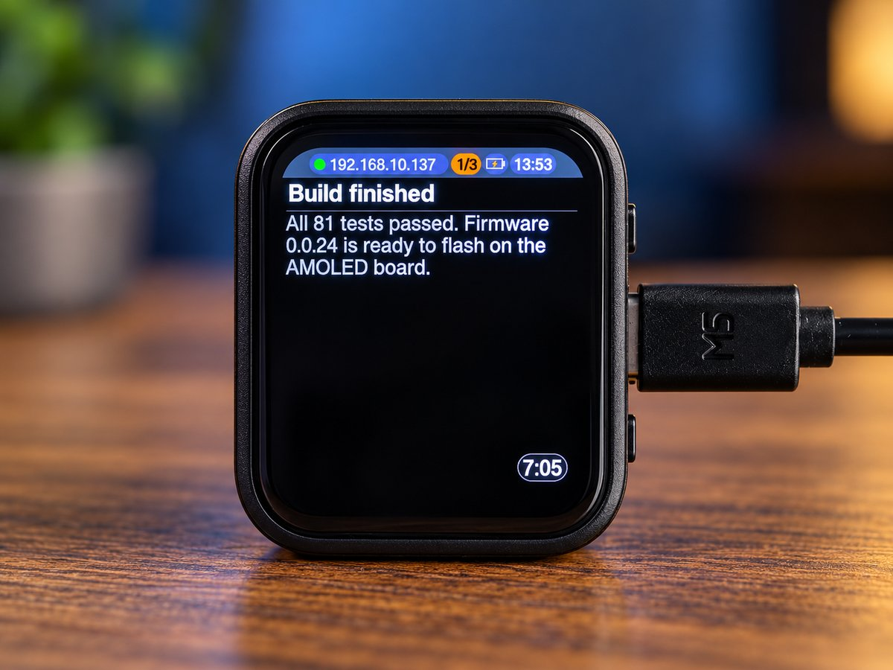
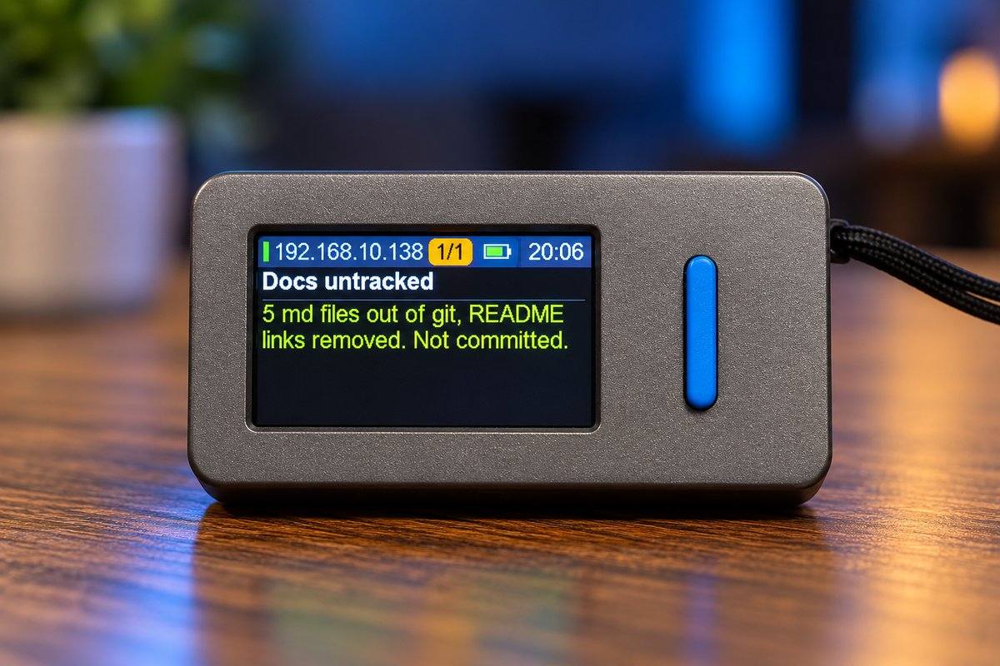
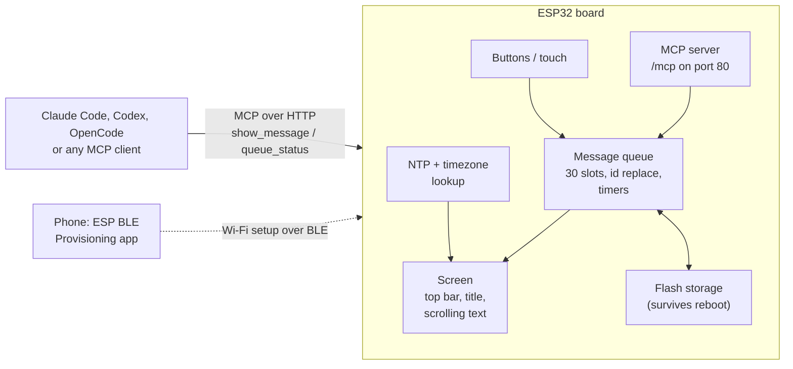
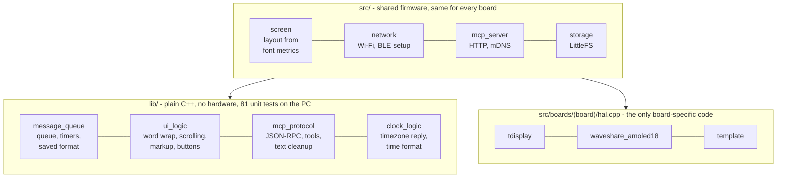

# ScreenAPI

<p align="center">
  
  
</p>

<p align="center">
  If ScreenAPI is useful to you, a coffee helps a lot. Projects like this need real boards to test on and many evenings to get right.
  <br><br>
  <a href="https://buymeacoffee.com/eucbuddy"></a>
</p>

**A small Wi-Fi desk display for your AI agents.** An ESP32 board with a screen runs an [MCP](https://modelcontextprotocol.io) server on your local network. Claude Code, Codex, OpenCode, or any other MCP client sends it status messages, and the device takes care of showing them: queuing, scrolling, colors, timers, and button or touch controls.


-00979D)


```text
+----------------------------------------------+
| [|] 192.168.x.x   [ 2/5 ] [bat] [ 14:32 ]    |
| Claude Code                                  |
|----------------------------------------------|
| Build passed, 81 of 81 tests green.          |
| Flashing the AMOLED board next.              |
|                                       [ 8s ] |
+----------------------------------------------+
```

---

## Contents

- [What it does](#what-it-does)
- [How it works](#how-it-works)
- [Features](#features)
- [Hardware](#hardware)
- [Built to be ported](#built-to-be-ported)
- [Getting started](#getting-started)
- [Sending messages](#sending-messages)
- [Development](#development)
- [Project status](#project-status)

---

## What it does

- **Your agents report to your desk.** Claude Code can say "started", "tests running", "done, please review" on a screen next to your keyboard, without you watching the terminal.
- **The device owns the message lifecycle.** Senders only pass data. The display queues up to 30 messages, shows the newest first, scrolls long text, counts down timed messages while they are on screen, and keeps confirm messages until you delete them.
- **Nothing to configure in code.** Wi-Fi is set up from your phone over Bluetooth; the MCP endpoint announces itself on the network as `screenapi.local`.

## How it works



## Features

| Area | What you get |
|------|--------------|
| **MCP** | Streamable HTTP transport at `http://<hostname>.local/mcp`. Tools `show_message` and `queue_status`. Errors come back as plain sentences an LLM can act on ("color must be one of: white blue green red."). Web pages cannot post to it (Origin check). |
| **Messages** | Title plus a value of up to 512 characters, two font sizes, four colors, and inline color tags: `Build {green}passed{/}, 2 {red}warnings{/}`. Non-ASCII typography (dashes, quotes, ellipsis) is converted for the fonts. |
| **Lifecycle** | *Timed* messages count down only while they are on screen, with the time left in a small box. *Confirm* messages stay until deleted. A message with the same `id` replaces the old one, so a status update never fills the queue. |
| **Queue** | 30 messages, newest first, saved to flash and restored after a reboot. When full, new messages are dropped, a popup says so, and the sender is told. |
| **Screen** | Top bar with connection status, IP address, queue position, battery, and clock (NTP, timezone from your IP). Long titles scroll sideways, long text scrolls down. Flicker-free, full-frame buffered drawing. |
| **Sound** | A short two-note chime for every message sent to the display, on boards with a speaker (Waveshare AMOLED, M5StickS3). |
| **Screen saver** | After a minute with no messages the screen turns off, and every 30 s it shows a 5 s animation of particles with fading trails. Any press or new message wakes it. The CPU runs at 160 MHz, 80 MHz while the screen is off. |
| **Controls** | Delete the shown message, hold to clear all, show the next message; hold both inputs for 5 s to reset Wi-Fi. |
| **Setup** | Wi-Fi via the ESP BLE Provisioning app: scan the QR code on the screen. A welcome screen shows the IP address and MCP URL. |

## Hardware

ScreenAPI runs on ESP32-family boards with Wi-Fi, BLE, and a display. Three boards are supported today; the firmware is structured so that adding more is mostly configuration (see [Built to be ported](#built-to-be-ported)).

| | LilyGO TTGO T-Display | Waveshare ESP32-S3-Touch-AMOLED-1.8 | M5Stack M5StickS3 |
|---|---|---|---|
| **Chip** | ESP32 (dual-core LX6, 240 MHz) | ESP32-S3 (dual-core LX7, 240 MHz) | ESP32-S3-PICO-1 (dual-core LX7, 240 MHz) |
| **Memory** | 4 MB flash, no PSRAM | 16 MB flash, 8 MB PSRAM | 8 MB flash, 8 MB PSRAM |
| **Display** | 1.14 inch IPS LCD, ST7789, 240 x 135, SPI | 1.8 inch AMOLED, 368 x 448, QSPI (CO5300 or SH8601) | 1.14 inch IPS LCD, ST7789P3, 240 x 135, SPI |
| **Orientation** | Landscape | Portrait | Landscape |
| **Input** | Two buttons | BOOT button and capacitive touchscreen | Two buttons (front and side) |
| **Battery** | Li-ion connector, voltage via ADC | Li-ion connector, AXP2101 power management chip | Built-in 250 mAh cell, M5PM1 power management chip |
| **Sound** | None | ES8311 codec and speaker: chime on new messages | ES8311 codec and speaker: chime on new messages |
| **USB** | USB-C with a USB-UART bridge | USB-C, native USB serial | USB-C, native USB serial |
| **PlatformIO env** | `tdisplay` | `waveshare_amoled18` | `m5sticks3` |
| **Status** | Verified on the device up to firmware 0.0.14 | Boots and runs Wi-Fi setup since 0.0.16 | Added in 0.0.28 |

### LilyGO TTGO T-Display

A compact, inexpensive ESP32 board with a small, sharp LCD, two buttons, and a battery connector. ScreenAPI uses it in landscape.

- **Controls:** the GPIO35 button deletes the shown message, hold 1.5 s to clear all; the GPIO0 (BOOT) button shows the next message; both held for 5 s reset Wi-Fi.
- **Battery:** read through a 2:1 divider on GPIO34; on USB power the top bar shows a lightning bolt.
- **Vendor:** [LilyGO TTGO T-Display](https://github.com/Xinyuan-LilyGO/TTGO-T-Display)

### Waveshare ESP32-S3-Touch-AMOLED-1.8

A larger, high-density AMOLED touch board with plenty of memory. ScreenAPI uses it in portrait with larger fonts. The board comes in two revisions (SH8601 display with FT3168 touch, and CO5300 with CST820); the firmware detects which one it runs on.

- **Controls:** BOOT deletes the shown message, hold 1.5 s to clear all; a touch on the screen shows the next message; BOOT and touch held for 5 s reset Wi-Fi.
- **Battery:** percentage, USB, and charge state from the AXP2101 power chip.
- **Sound:** a two-note chime when a message arrives, through the ES8311 codec and the onboard speaker.
- **Vendor:** [Waveshare ESP32-S3-Touch-AMOLED-1.8](https://github.com/waveshareteam/ESP32-S3-Touch-AMOLED-1.8)

### M5Stack M5StickS3

A pocket-sized ESP32-S3 stick with a small LCD, two buttons, a speaker, and a built-in battery. ScreenAPI uses it in landscape with the same layout as the T-Display.

- **Controls:** the front button (KEY1) deletes the shown message, hold 1.5 s to clear all; the side button (KEY2) shows the next message; both held for 5 s reset Wi-Fi. The separate power button is left to the board.
- **Battery:** cell voltage and USB presence from the M5PM1 power chip, which also switches the display supply and the speaker amplifier.
- **Sound:** the same two-note chime as the AMOLED, through its ES8311 codec.
- **Vendor:** [M5Stack M5StickS3](https://docs.m5stack.com/en/core/StickS3)

## Built to be ported

The goal is that any ESP32 with Wi-Fi and a display can run ScreenAPI with one small file of board code. The firmware is split into three layers:



- **`lib/`** holds the logic: the queue and its lifecycle, word wrap and scrolling, the MCP protocol, the clock. It has no Arduino or hardware dependency and is tested on the host with `pio test -e native`.
- **`src/`** is the firmware shared by all boards. The screen layout is computed from the screen size and from the fonts the board chooses, so it adapts to landscape and portrait panels of any size from 240 x 135 up.
- **`src/boards/<board>/hal.cpp`** implements [`src/hal.h`](src/hal.h), a small interface of twelve functions: start the board, return the display driver and fonts, read two inputs, and optionally read the battery and play a chime. Pins and screen size live in `include/boards/<board>/`.

### Porting to your board

1. Copy `include/boards/template/` and `src/boards/template/` to a new board name.
2. Set the screen size, rotation, and hostname in `board.h`, your wiring in `pins.h`.
3. In `hal.cpp`, pick your display driver from [Arduino_GFX](https://github.com/moononournation/Arduino_GFX) (ST7789, ILI9341, GC9A01, CO5300, and many more; SPI, QSPI, parallel, RGB), choose four u8g2 fonts for your pixel density, and map your buttons or touchscreen.
4. Add an env to `platformio.ini` (copy the `template` env), build, and flash.

The `template` env builds the template for a generic ESP32 with an ST7789 SPI display, so the starting point always compiles.

**Requirements:** ESP32-family chip with Wi-Fi and BLE (BLE is used for Wi-Fi setup), a display supported by Arduino_GFX with at least 240 x 135 pixels, width x height bytes of RAM for the frame buffer (PSRAM is used when present), two inputs (a touchscreen can be one), and about 1.8 MB for the app.

## Getting started

### 1. Build and flash

Install [PlatformIO](https://platformio.org), connect the board over USB, and flash its environment:

```sh
# LilyGO TTGO T-Display
pio run -e tdisplay -j 2 -t upload

# Waveshare ESP32-S3-Touch-AMOLED-1.8 (always pass -e: the default env is the T-Display)
pio run -e waveshare_amoled18 -j 2 -t upload --upload-port /dev/ttyACM0

# M5Stack M5StickS3 (also /dev/ttyACM0: check which board is connected before flashing)
pio run -e m5sticks3 -j 2 -t upload --upload-port /dev/ttyACM0
```

`-j 2` limits parallel compiler jobs; the U8g2 font source needs about 1 GB of RAM per job.

### 2. Connect it to Wi-Fi

On first start the board shows a QR code. Scan it with the **ESP BLE Provisioning** app (Espressif, Android and iOS), pick your network, and enter the password. The board connects, shows a welcome screen with its IP address, and remembers the network. To change networks later, hold both inputs for 5 seconds.

### 3. Connect your coding agent

The endpoint is `http://screenapi.local/mcp`: MCP over plain HTTP, no login or token. Name the server `screen` in any client.

**Claude Code**

```sh
claude mcp add --transport http screen http://screenapi.local/mcp
```

Check it with `/mcp` inside Claude Code.

**Codex** (CLI, IDE extension, and desktop app share one config)

```sh
codex mcp add screen --url http://screenapi.local/mcp
```

This adds the following to `~/.codex/config.toml`, which you can also write by hand:

```toml
[mcp_servers.screen]
url = "http://screenapi.local/mcp"
```

Check it with `codex mcp list` (status `enabled`) or `/mcp` inside Codex. Codex prints that the server "may or may not require login"; it does not, so skip `codex mcp login`.

**OpenCode**

OpenCode has no `mcp add` command; add the server to `~/.config/opencode/opencode.json` (all projects) or to `opencode.json` in a project:

```json
{
  "$schema": "https://opencode.ai/config.json",
  "mcp": {
    "screen": {
      "type": "remote",
      "url": "http://screenapi.local/mcp",
      "enabled": true,
      "oauth": false
    }
  }
}
```

`"oauth": false` stops OpenCode from looking for a login the display does not have. Check it with `opencode mcp list`, which should show `screen connected`.

**Any other client:** point it at `http://screenapi.local/mcp` with the Streamable HTTP transport. The server answers in JSON and does not use sessions or server-to-client streams.

On Linux, `.local` names need an mDNS resolver (`avahi-daemon` and `libnss-mdns`); otherwise use the IP address from the welcome screen in place of `screenapi.local`.

Every board answers at `screenapi.local`, so one setting works whichever board is plugged in. Keep one board online at a time; after switching boards, reconnect (`/mcp` in Claude Code or Codex, or restart OpenCode), and allow up to about 2 minutes for the old address to leave the mDNS cache.

## Sending messages

From any connected agent, just ask: *"Show 'Deploy finished' in green on the screen for 30 seconds."* In OpenCode, naming the server helps: *"... use the screen tool."*

The `show_message` tool takes:

| Field | Values | Default |
|-------|--------|---------|
| `value` | Text, up to 512 characters; newlines and `{green}...{/}` color tags allowed | required |
| `title` | One line, up to 64 characters; scrolls sideways if too long | empty |
| `color` | `white` (drawn light grey, below the white title), `blue`, `green`, `red` | `white` |
| `font_size` | `small`, `large` | `small` |
| `kind` | `timed` (removed after its time on screen) or `confirm` (stays until deleted) | `timed` if `duration_s` is given, else `confirm` |
| `duration_s` | 1 to 86400 | - |
| `id` | Up to 16 characters; a message with the same id replaces the old one | none |

### Let your agent report its progress

Add these instructions to your project's `CLAUDE.md` (Claude Code) or `AGENTS.md` (Codex, OpenCode). The agent then posts short progress messages while it works. Questions and the final result stay on screen until you deal with them.

```markdown
## Status messages on the desk display

Report task progress on the ScreenAPI display through its MCP tool `show_message` (server `screen`, `http://screenapi.local/mcp`).

- Task start: a timed message, `duration_s` 10, saying what the task is.
- Each major step: a timed message, `duration_s` 10.
- Question or decision for the user (including a plan waiting for approval): a confirm message in blue, so it stays on screen until answered. Say briefly what is being asked; the full question stays in the chat.
- Task end: a confirm message (no `duration_s`, `kind` confirm), so it stays until the user deletes it. Green when the task succeeded, red when it failed or is blocked.
- Use one `id` per task (for example `job-<topic>`, at most 16 characters) for the start, step, question, and end messages, so each replaces the previous one; a question disappears with the next update after the answer.
- Keep titles and values short and ASCII.
- If the `screen` tool is not available, send the same JSON-RPC `tools/call` with curl. If the display cannot be reached, continue the task and say so in the report.
```

### With curl

Any HTTP client can send messages: the MCP endpoint takes plain JSON-RPC over POST, with no session or token. Set the URL once; if `screenapi.local` does not resolve on your machine, use the IP address shown in the top bar.

```sh
URL=http://screenapi.local/mcp    # or http://<ip-in-the-top-bar>/mcp
```

```sh
# Plain message; stays until you delete it on the device (confirm)
curl -s $URL -H 'Content-Type: application/json' -d '{"jsonrpc":"2.0","id":1,"method":"tools/call",
  "params":{"name":"show_message","arguments":{"value":"Hello from curl"}}}'

# Timed message with a title: removed after 30 s on screen
curl -s $URL -H 'Content-Type: application/json' -d '{"jsonrpc":"2.0","id":1,"method":"tools/call",
  "params":{"name":"show_message","arguments":{"title":"Coffee","value":"The coffee is ready","duration_s":30}}}'

# Large red text that must be confirmed
curl -s $URL -H 'Content-Type: application/json' -d '{"jsonrpc":"2.0","id":1,"method":"tools/call",
  "params":{"name":"show_message","arguments":{"title":"Alert","value":"Server down","color":"red","font_size":"large","kind":"confirm"}}}'

# Inline colors and a second line (\n)
curl -s $URL -H 'Content-Type: application/json' -d '{"jsonrpc":"2.0","id":1,"method":"tools/call",
  "params":{"name":"show_message","arguments":{"title":"CI","value":"Build {green}passed{/}\n2 {red}warnings{/}, 0 {blue}notes{/}","duration_s":60}}}'

# Progress that updates in place: the same id replaces the message instead of adding one
curl -s $URL -H 'Content-Type: application/json' -d '{"jsonrpc":"2.0","id":1,"method":"tools/call",
  "params":{"name":"show_message","arguments":{"id":"backup","title":"Backup","value":"Step 1 of 3: copying","duration_s":120}}}'
curl -s $URL -H 'Content-Type: application/json' -d '{"jsonrpc":"2.0","id":1,"method":"tools/call",
  "params":{"name":"show_message","arguments":{"id":"backup","title":"Backup","value":"{green}Done{/}","kind":"confirm"}}}'

# How many messages are queued
curl -s $URL -H 'Content-Type: application/json' -d '{"jsonrpc":"2.0","id":1,"method":"tools/call",
  "params":{"name":"queue_status","arguments":{}}}'

# List the tools and their parameters
curl -s $URL -H 'Content-Type: application/json' -d '{"jsonrpc":"2.0","id":1,"method":"tools/list"}'
```

Each call answers with JSON; the text in `result.content` says what happened, for example `Shown on the display. Queue: 3 of 30 messages.` A rejected message comes back with `"isError": true` and the reason, such as a full queue or a value over 512 characters.

For quick notes from a terminal, a shell function (the text must not contain double quotes or backslashes):

```sh
screen() {
  curl -s http://screenapi.local/mcp -H 'Content-Type: application/json' -d '{"jsonrpc":"2.0","id":1,
    "method":"tools/call","params":{"name":"show_message","arguments":{"value":"'"$1"'","duration_s":'"${2:-30}"'}}}'
  echo
}

screen "Tea is ready" 60    # 60 s on screen; without a number, 30 s
```

## Development

| Task | Command |
|------|---------|
| Unit tests (host, no hardware) | `pio test -e native` |
| Build one board | `pio run -e <env> -j 2` |
| Serial log | `pio device monitor -e <env>` |
| Screenshot of the device screen | `python3 tools/screenshot.py screen.png --port <port>` |
| Bump the firmware version | edit `VERSION` (not platformio.ini: any change there triggers a full rebuild) |

## Project status

ScreenAPI is an early MVP (firmware 0.0.x). All MVP features are implemented; on-device checks are still open for the latest graphics changes on the T-Display and for the display, touch, and Wi-Fi setup on the AMOLED board.

**Security:** the MCP endpoint has no authentication; anyone on your local network can post messages. It rejects requests from web pages (Origin check), but do not expose it to the internet. The clock's timezone lookup uses [ip-api.com](https://ip-api.com), free for non-commercial use.

**License:** not chosen yet. Until a license file is added, all rights are reserved by the author.
